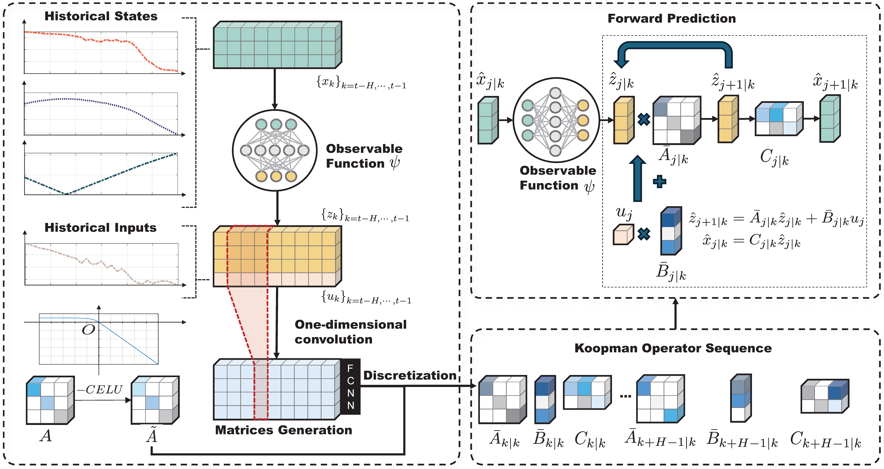

<div align="center">

<h1>MamKO: Mamba-based Koopman operator for modeling and predictive control</h1>

<div>
Zhaoyang Li<sup>1</sup>, Minghao Han<sup>2</sup>, Xunyuan Yin<sup>1,2,*</sup>


 1. School of Chemistry, Chemical Engineering and Biotechnology, Nanyang Technological University

2. Nanyang Environment and Water Research Institute, Nanyang Technological University

</div>

<div>
    <h4 align="center">
        • <a href="https://openreview.net/pdf?id=hNjCVVm0EQ" target='_blank'>ICLR 2025</a> •
    </h4>
</div>

## Overviewd


</div>

# Conda environment setup
Create a conda env and activate:
```bash
conda create -n test python=3.12
conda activate test
```

# Installation Environment
```bash
pip install -r requirements.txt
```
You may need to install MOSEK according to **[MOSEK installation guide](https://docs.mosek.com/10.2/install/index.html)**.

# Run the code
For training process, you can run
```bash
python train.py {method} {environment}
```
to train the model.

Method can be **DKO** **mamba** **MLP**;
Environment can be **cartpole** and **cartpole_V**.

For the control process, you can run 
```bash
python control.py {method} {environment}
```
to evaluate the control performance of the given model.

Method can be **DKO** **mamba** **MLP**;
Environment can be **cartpole** and **cartpole_V**.


